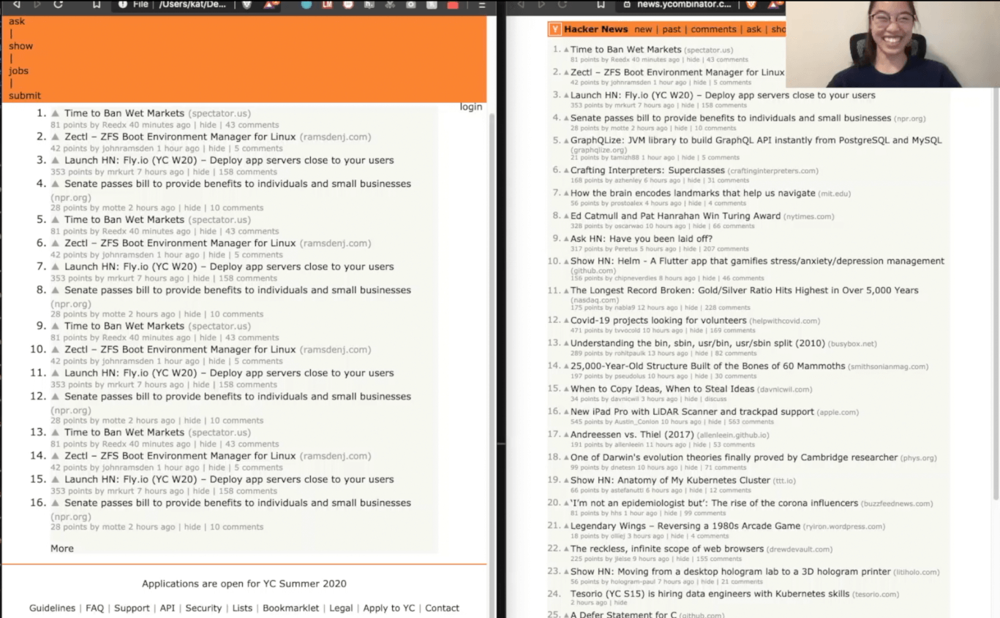

# Re-creating websites in HTML/CSS without previewing the results in the end (& livestreaming the process)

No inspect element allowed 😤

Allowed: VSCode + Emmet, color picker, ~~hints from stream viewers apparently~~

Time limit: ~30 minutes

[Streamed on Twitch](https://twitch.tv), recordings on YouTube, code here :)

----

Example result, from [3/18/20 attempt](2020-03-18-hacker-news) to re-create Hacker News:

